# CI2024_project-work
Project work for the Computational Intelligence Exam

## Symbolic Regression

This project focuses on implementing a [Genetic Programming](https://en.wikipedia.org/wiki/Genetic_programming) algorithm for the [Symbolic Regression](https://en.wikipedia.org/wiki/Symbolic_regression).  
Symbolic Regression is like a treasure hunt for the perfect mathematical equation to describe a dataset - [**_Casper Wilstrup_**](https://medium.com/@wilstrup/symbolic-regression-a-simple-and-friendly-introduction-16bcadbe870a)  
It analyzes data in order to find the best mathematical representation for them. It searches through a vast space of mathematical expressions until it finds the one that best fits the data and that is also simple for us humans to understand.

The problem is described as follows:
> Given a dataset that consists of inputs and their respective outputs, the goal is to find a symbolic expression that closely approximates the relationship between the pairs. In this project, we will be working with eight different datasets.

---

## How It Works

- **Individuals as Formulas**  
  Each candidate solution, called an **individual**, is a mathematical formula made up of operators (`add`, `mul`, `sin`, etc.), variables, and constants.  
  For example, the individual representing `add(sin(x0), mul(2.0, x1))` combines the operator `add`, the sub-individual `sin(x0)`, and the sub-individual `mul(2.0, x1)`.

- **Evolutionary Process**  
  The system evolves individuals over many generations. At each step:  
  - **Mutation** changes a small part of an individual (e.g., replacing an operator, swapping parts, or replacing with a constant).  
  - **Crossover** mixes two individuals by exchanging parts of their structure.  
  - **Selection** chooses which individuals survive to the next generation.  

- **Monte Carlo Choice**  
  Instead of always keeping only the best individuals, a Monte Carlo mechanism is used. Think of it like picking marbles from a bag: the better an individual, the heavier its marble, but even lighter marbles still have a chance. This prevents the system from settling too quickly on a single “good but not perfect” solution.

- **Islands and Migration**  
  The population is divided into separate groups (islands), each evolving independently. From time to time, individuals migrate between islands. This exchange maintains diversity and increases the chance of discovering better solutions.

- **Escaping Stagnation**  
  If the evolution stalls and no progress is made, the system refreshes part of the population and temporarily increases randomness. This shake-up helps individuals explore new and potentially better regions of the search space.

---

## What You Get

At the end of training, the system doesn’t just give predictions—it produces a **human-readable formula** represented by the best individual. For example:

add(sin(x0), mul(cos(x1), 2.0))

Alongside the formula, you also see:  
- How fitness improved over generations.  
- How well the discovered expression matches the dataset.  
- Plots comparing predictions to ground truth.  

---

## Why It’s Interesting

Unlike black-box models, symbolic regression provides **interpretable equations**. The formulas discovered by the individuals are both accurate and understandable, offering insights into the underlying data. This project demonstrates how concepts inspired by evolution—mutation, crossover, survival of the fittest, and migration—can work together to uncover elegant mathematical relationships.

## Results

The results obtained with this strategy are based on this parameters:

`NUM_ISLANDS` 7
`ISLAND_POPULATION` 125
`GENERATIONS` 1000
`MAX_DEPTH` 11
`MUTATION_RATE` 0.3
`TOURNAMENT_SIZE` 3
`MIGRATION_INTERVAL` 150
`MIGRATION_SIZE`4
`PRINT_INTERVAL` 100
`INDIVIDUAL_ATTEMPTS` 10
`TEST_TRAIN` 0.7
`STAGNATION_THRESHOLD` 60
`POPULATION_SIZE` = `NUM_ISLANDS` * `ISLAND_POPULATION`

| Problem N. | MSE | Function |
| ------------- |:-------------:| -----:|
| 1 | 8.217301096052206e-34 | sin(x0) |
| 2 | 1467003503733.0408 | mul(add(mul(sub(max(add(add(add(add(x0, x2), add(x0, x0)), add(add(min(x2, x0), add(x0, x1)), add(x0, x0))), div(add(add(add(x0, x1), asin(x2)), add(min(x0, x0), sub(x0, 1))), add(x0, add(x0, x1)))), pow(pow(div(x0, add(add(x0, x2), 0.693147)), asin(mod(min(x1, sqrt(1.61803)), mul(x0, x0)))), x0)), add(add(mul(sub(exp(add(x0, x1)), pow(x0, 1.41421)), add(add(cosh(x0), add(x0, x0)), add(add(x0, x2), add(mul(x1, x2), x0)))), add(asin(x2), add(pow(x0, add(x0, x2)), x2))), add(add(x0, add(add(x0, mul(x0, log2(x1))), pow(x0, add(x0, x2)))), pow(x0, add(add(x0, x2), x1))))), add(add(x2, x2), add(add(x0, x1), add(add(x2, x2), add(x1, x1))))), sqr(sinh(asin(add(div(add(add(cosh(3.14159), x2), add(x0, x1)), x0), 0))))), add(add(add(cbrt(add(add(add(add(add(x0, x2), add(x0, x1)), add(add(x0, x2), add(x0, x1))), div(add(add(x0, x2), add(x0, x1)), 0.5)), add(add(add(add(x0, x2), add(x0, x0)), add(add(x0, sub(x1, 1)), add(x0, x0))), div(add(add(x0, x2), add(x0, x1)), 0.5)))), sin(cbrt(add(add(add(x0, x2), add(sin(x1), add(x1, x1))), add(add(log(0.693147), max(0, x0)), add(add(x0, x2), mul(add(1, 0.693147), cbrt(x1)))))))), cbrt(sin(cbrt(add(add(add(x0, add(log(2), x0)), add(add(x0, x2), add(x1, x1))), add(add(x0, x2), add(add(x2, x2), x0))))))), sin(cbrt(sin(cbrt(add(add(add(x0, add(x0, x0)), add(add(x0, x2), add(x1, x1))), add(add(x0, x1), add(add(x2, x2), add(x0, x1)))))))))) |
| 3 | 6.576629007103656e-29 | add(sub(sub(sub(sub(sqr(x0), x2), sqr(x1)), sub(sub(x1, sqr(x0)), 2)), mul(mul(x1, 2), min(sqr(x1), sqr(div(x1, 2))))), add(sub(sub(sub(x1, div(x2, 2)), add(x2, sub(x2, 2))), sqr(sqr(div(x1, 2)))), sqr(sub(x1, sqr(div(x1, 2)))))) |
| 4 | 5.9398654290880356e-08 | add(add(add(cos(x1), div(add(cos(sinh(mod(mod(min(mod(2, 3.14159), rec(0)), 1.73205), cbrt(2.71828)))), div(neg(x0), cosh(cos(2.71828)))), cosh(2.71828))), cos(x1)), add(add(add(2.71828, add(min(max(add(0.693147, cos(x1)), add(2.71828, cos(x1))), min(max(x1, exp(2.71828)), cos(x1))), cos(x1))), add(add(cos(x1), log10(2.71828)), cos(x1))), cos(x1))) |
| 5 | 5.786578949053965e-18 | rec(sqr(sub(mul(max(sqr(asin(pow(log10(max(max(1, x1), sinh(-1))), div(div(mod(1, x0), cos(2)), 2)))), x0), max(sin(x1), sub(acos(x1), x1))), x0))) |
| 6 | 3.496290373942904e-07 | add(div(sub(x1, x0), min(sqrt(cosh(exp(3.14159))), atan(cosh(2.71828)))), x1) | 
| 7 | 31.7706 | mul(max(max(add(pow(mul(add(sqr(mod(mul(x0, sinh(3.14159)), add(x1, mul(0.693147, x0)))), pow(add(sqrt(2.30259), cos(x1)), max(cosh(mod(x0, 1.41421)), x1))), sqr(abs(add(sqr(add(x1, x0)), exp(atan(2.30259)))))), tanh(tanh(tanh(log10(sqr(1.73205)))))), sqr(mod(mul(x1, sinh(2.71828)), add(x1, mod(mul(max(x0, x1), sinh(2.71828)), add(max(x0, x0), x0)))))), pow(mul(add(sqr(add(1.61803, x0)), exp(cos(max(x1, sin(x0))))), abs(add(sqr(add(x1, x0)), exp(cos(x0))))), tanh(tanh(tanh(mul(mul(max(x0, x1), sinh(2.71828)), pow(sqr(x1), 1.73205))))))), sqr(add(mul(mod(sin(2.71828), log2(sub(x1, x0))), sub(sin(min(atan(x1), min(x0, x1))), x0)), x0))), max(add(sqr(tanh(tanh(add(pow(sqr(x1), 1.73205), atan(1.73205))))), mul(add(atan(1.73205), mod(mul(mul(sqr(1.73205), max(sinh(x1), 0)), sub(x0, max(x1, x1))), add(add(max(1.73205, 1.73205), x0), mod(mul(x0, tan(1.73205)), add(x1, x1))))), tanh(mul(mod(max(log2(sub(x1, x0)), min(atan(x1), min(x0, x1))), log2(sub(x1, x0))), sub(sin(x0), x0))))), mul(sub(sub(sin(log2(sub(x1, x0))), sin(x0)), neg(add(sqr(x1), mul(pow(1, x0), tanh(add(sqrt(2.30259), cos(x1))))))), add(add(add(add(add(1.73205, sub(x1, max(x0, x1))), sub(x1, max(x0, x1))), sub(min(x0, x1), max(x0, x1))), sub(x0, max(x0, x1))), sub(min(x0, x1), max(x0, x1)))))) |
| 8 | 5.197644e+03 | add(sub(sub(mul(mul(mul(2.302585092994046, sqr(x5)), mul(sqr(x5), 2.302585092994046)), x5), sqr(mul(sqr(x4), 2.302585092994046))), div(mul(x5, mul(mul(log(sqr(x5)), log(mul(sqr(x5), 1.7320508075688772))), sqr(x5))), 1.7320508075688772)), log2(add(min(mul(add(mod(atan(atan(atan(x3))), 1.4142135623730951), atan(sub(1.618033988749895, 2.302585092994046))), mod(atan(3.141592653589793), sinh(sinh(x3)))), mul(mul(sqr(atan(log(sqr(x5)))), sqr(mul(2.302585092994046, div(2.302585092994046, add(1.7320508075688772, x1))))), sqr(x3))), max(sub(exp(add(mul(sinh(x3), 3.141592653589793), mul(mul(x3, 2.302585092994046), 3.141592653589793))), mul(sqr(exp(sqr(x1))), sqr(mul(sqr(sqr(x3)), mul(sinh(x3), 3.141592653589793))))), max(div(sinh(add(mul(sqr(x4), sqr(x4)), mul(sqr(x4), min(sub(x3, 1.7320508075688772), x3)))), sqr(min(x5, sinh(sinh(x3))))), div(exp(add(mul(sqr(x4), sqr(x3)), mul(x3, mul(x3, 3.141592653589793)))), log2(sinh(atan(atan(x3)))))))))) |

## Results as Images

__*Problem 1*__

Formula as Tree:

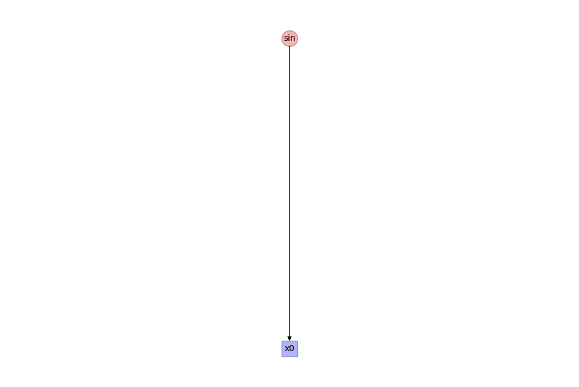

Fitness evolution:

__*Problem 2*__

Formula as Tree:

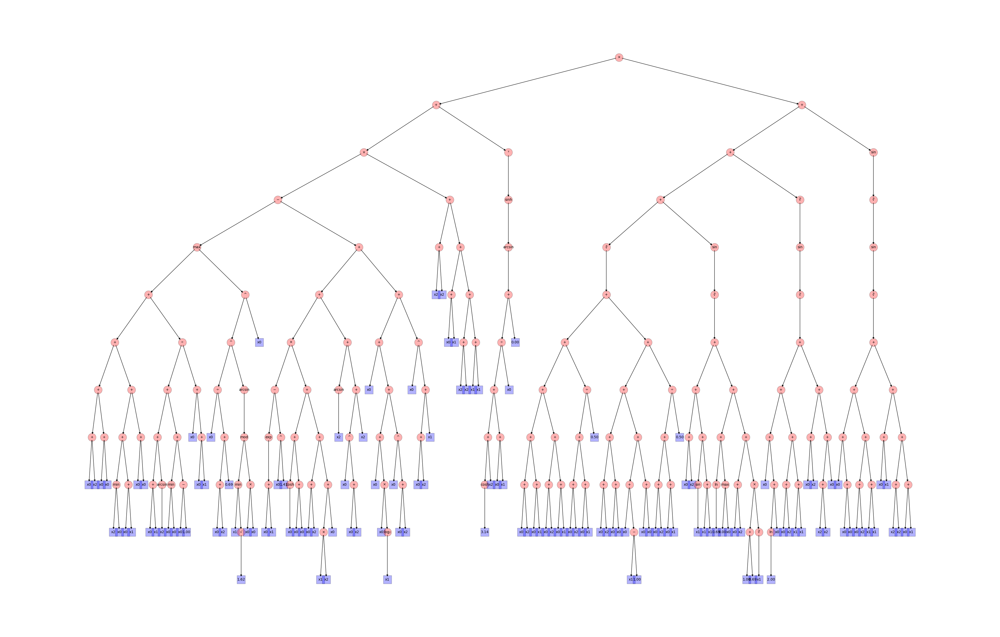

Fitness evolution:

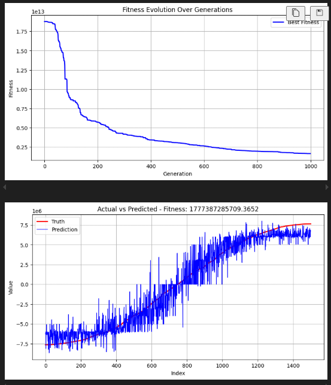

__*Problem 3*__

Formula as Tree:

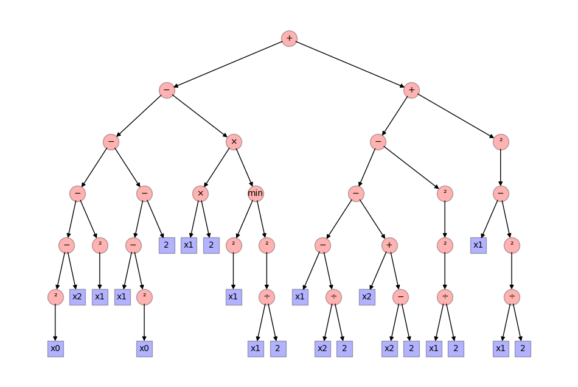

Fitness evolution:

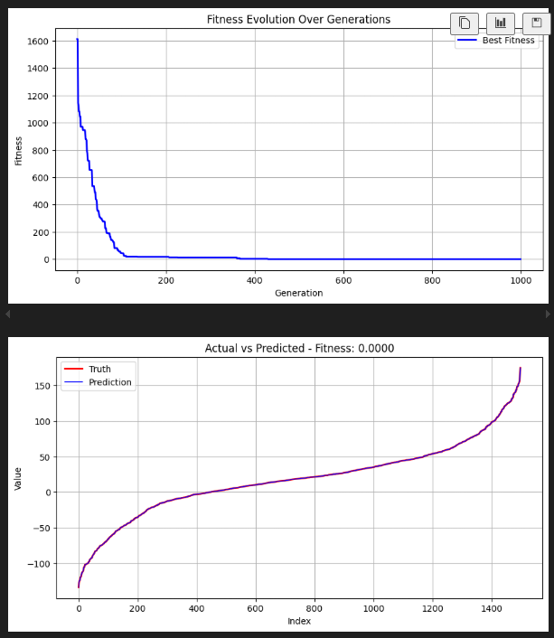

__*Problem 4*__

Formula as Tree:

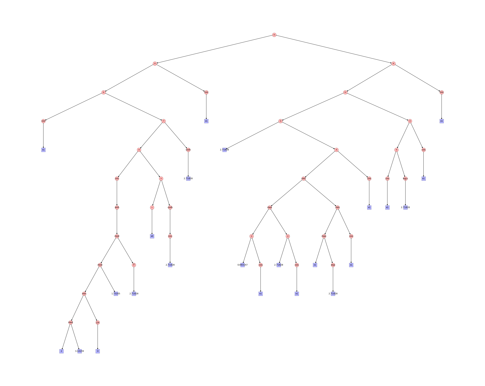

Fitness evolution:

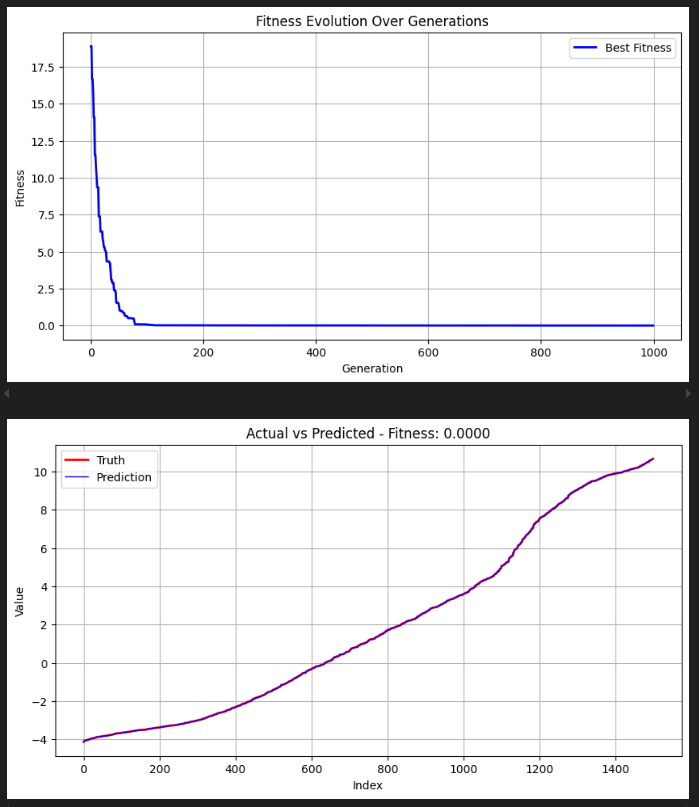

__*Problem 5*__

Formula as Tree:

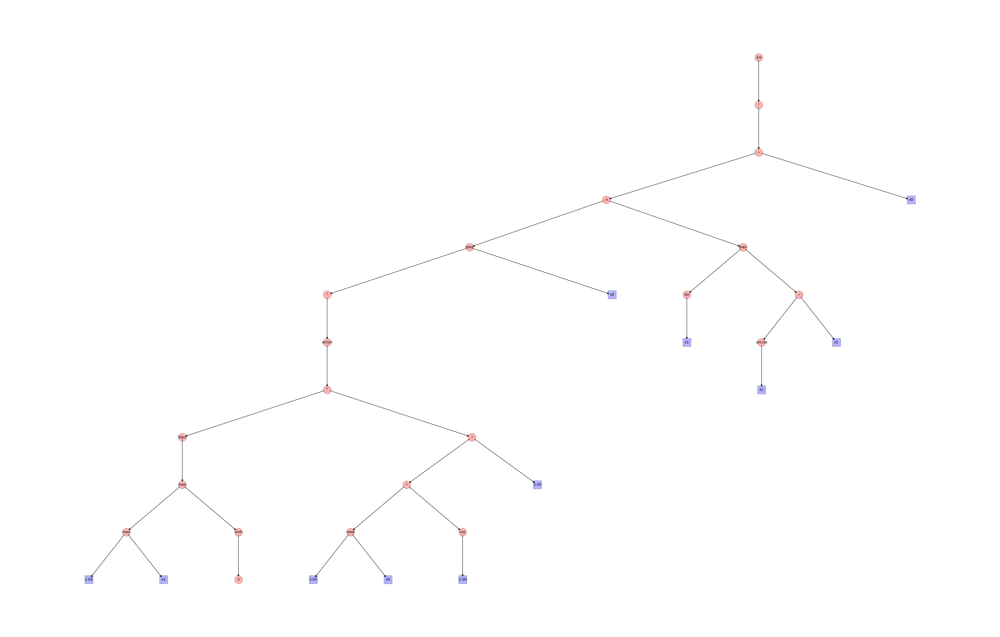

Fitness evolution:

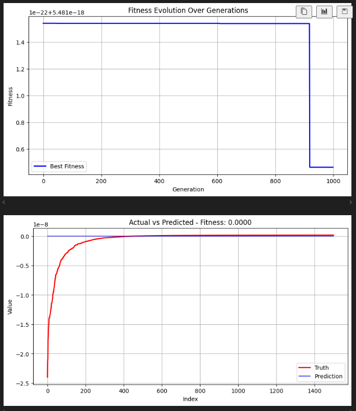

__*Problem 6*__

Formula as Tree:

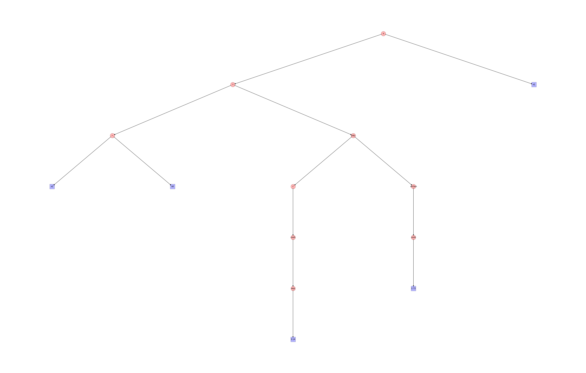

Fitness evolution:

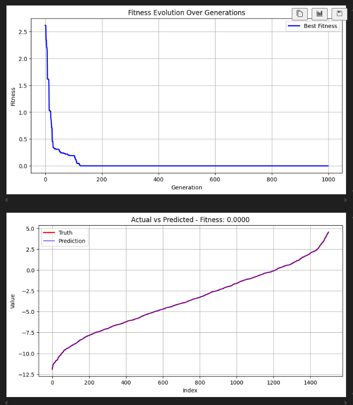

__*Problem 7*__

Formula as Tree:

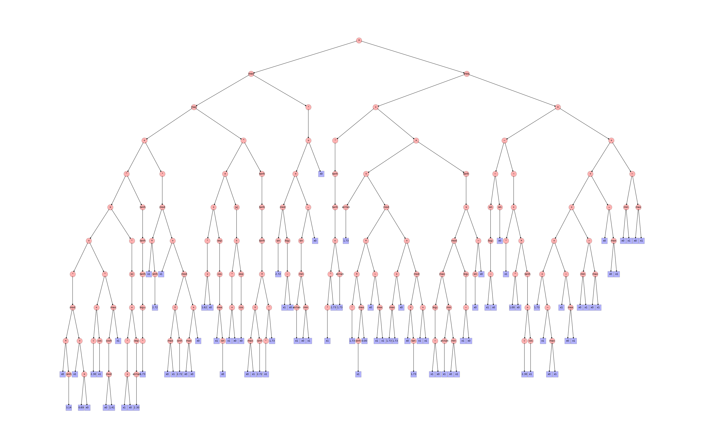

Fitness evolution:

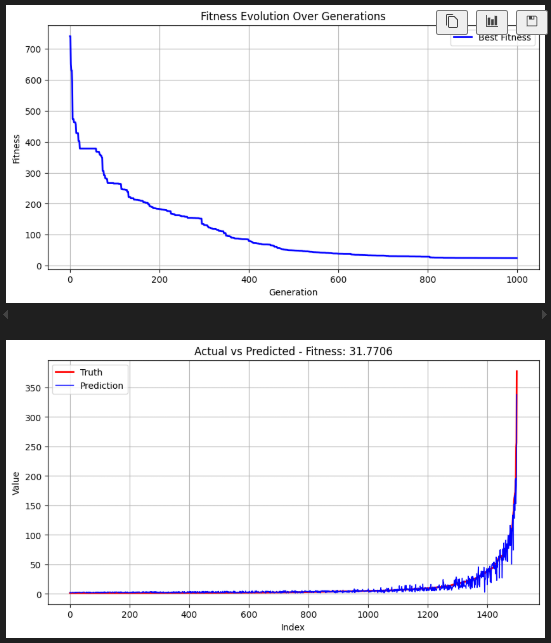

__*Problem 8*__

Formula as Tree:

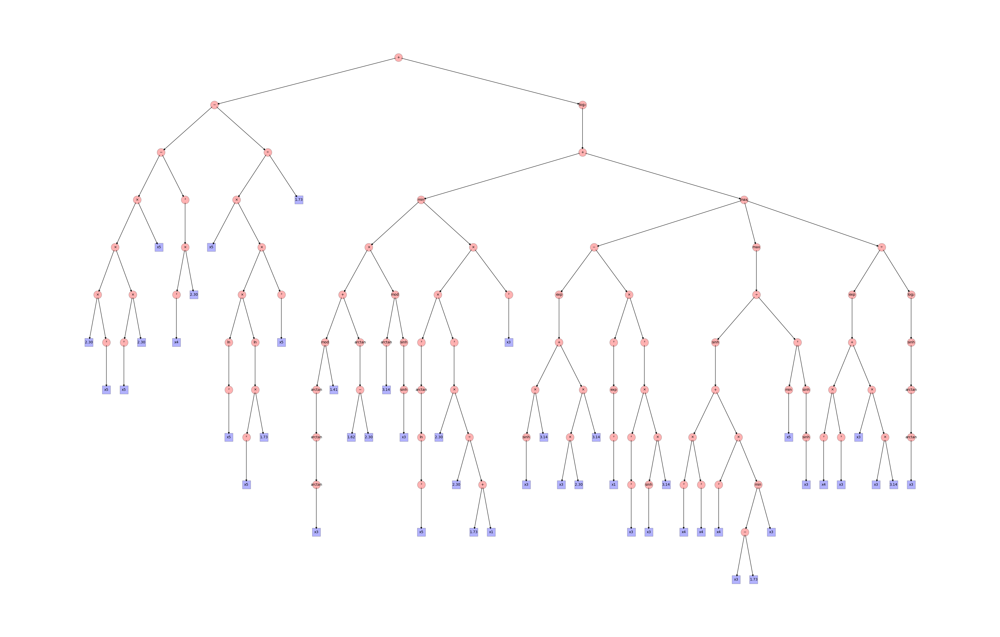

Fitness evolution:

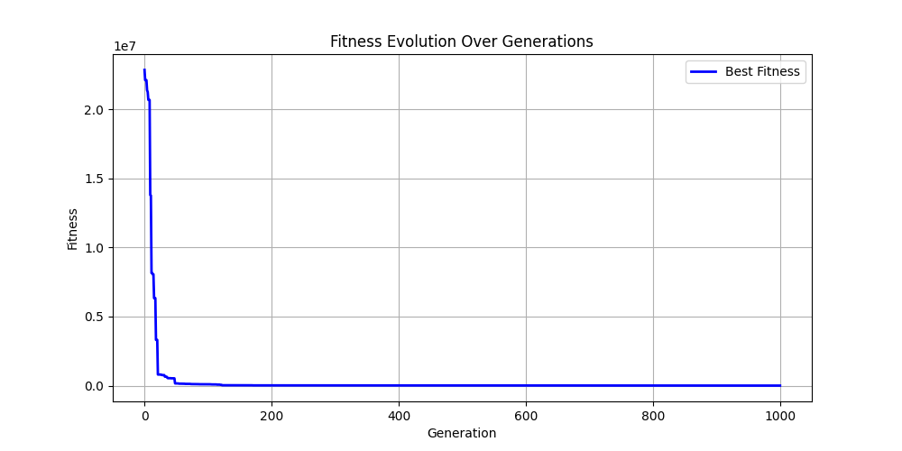
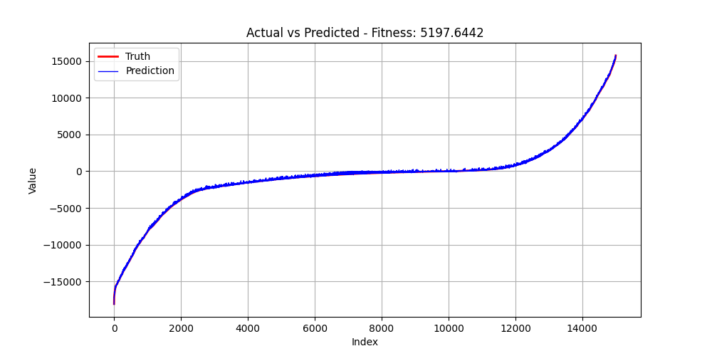